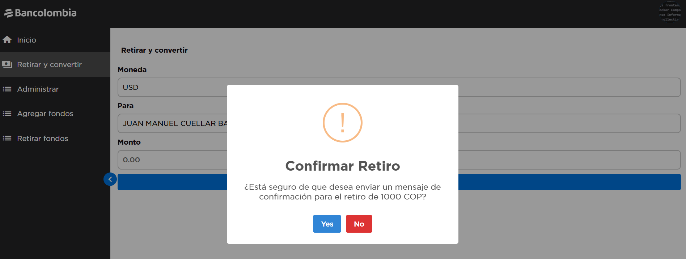

This repository contains a full-stack application built using **NestJS** for the backend and **Vue.js with Vite** for the frontend. The project is containerized using **Docker Compose**, and API documentation is provided via a **Postman Collection**.

## Table of Contents

- [Project Structure](#project-structure)
- [Prerequisites](#prerequisites)
- [Installation](#installation)
  - [Backend](#backend)
  - [Frontend](#frontend)

## Project Structure

The project is organized into the following directories:


## Prerequisites

Before you begin, ensure you have the following installed on your machine:

- [Node.js](https://nodejs.org/ ) (v20+ recommended)
- [Docker](https://www.docker.com/ ) and [Docker Compose](https://docs.docker.com/compose/ )
- [Postman](https://www.postman.com/ ) (optional, for API testing)

## Installation

### Backend

Navigate to the `backend` directory:
   ```bash
   cd backend
   npm install
   npm run start
  ```

### Frontend

Navigate to the `frontend` directory:
   ```bash
   cd frontend
   npm install
   npm run dev
  ```

### Docker compose

Navigate to the `root` directory:
   ```bash
   docker-compose up --build
   docker-compose down
  ```

### Login


### Registro

#### Formulario


#### Pago


#### Monto


### Dashboard

#### Usuario


#### Admin


### Menu

#### Retirar y convertir




#### Administrar


##### Transacciones


##### Cuentas bancarias


#### Agregar fondos a un usuario (SOLO ADMINS)


#### Retirar fondos a un usuario (SOLO ADMINS)

